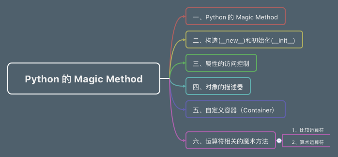

# 前言 #

有时候修改文章，真的修改到想死。真的很耗时间，很烦的。

好吧，每次都是安慰自己，快完结了，快更新完了。

# 目录 #

这一篇的目录如下：

- 一、Python 的 Magic Method
- 二、构造（`__new__`）和初始化（`__init__`）
- 三、属性的访问控制
- 四、对象的描述器
- 五、自定义容器（Container）
- 六、运算符相关的魔术方法
    - 1、比较运算符
    - 2、算术运算符

