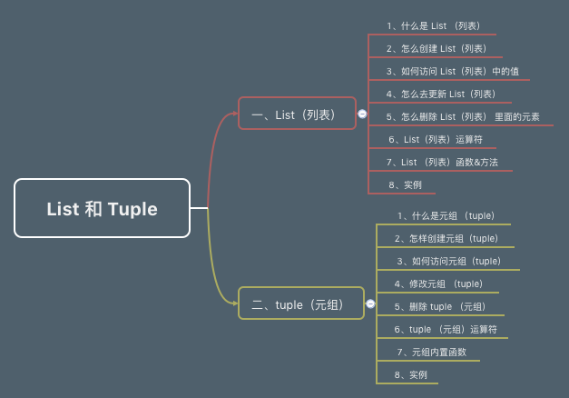

# 前言 #

之前我们学习了字符串，整数，浮点数几种基本数据类型，现在我们接着学习两种新的数据类型，列表（List）和元组（tuple）。

# 目录 #

- 一、List（列表）
    1. 什么是 List（列表）
    2. 怎么创建 List（列表）
    3. 如何访问 List（列表）中的值
    4. 怎么去更新 List（列表）
    5. 怎么删除 List（列表）里面的元素
    6. List（列表）运算符
    7. List（列表）函数 & 方法
    8. 实例
- 二、tuple（元组）
    1. 什么是元组（tuple）
    2. 怎样创建元组（tuple）
    3. 如何访问元组（tuple）
    4. 修改元组（tuple）
    5. 删除 tuple（元组）
    6. tuple（元组）运算符
    7. 元组内置函数
    8. 实例

