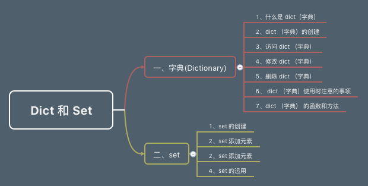

# 前言 #

上一篇文章出现了个明显的知识点错误，不过感谢有个网友的提出，及时进行了修改。也希望各位多多包涵。

>注：(2019年09月01日15:28:00) 在修改文章的时候，发现自己两年前写的像屎一样, 忍不住还在群里吐槽一番。

> 群友：@水哥 水哥是在写 Python 教程吗
>
> 水哥：在修改
>
> 水哥：两年前写完了基础教程的
>
> 水哥：最近在全部修改一边
>
> 水哥：发现之前写的就是 屎

# 目录 #

- 一、字典（Dictionary）
    1. 什么是 dict（字典）
    2. dict（字典）的创建
    3. 访问 dict（字典）
    4. 修改 dict（字典）
    5. 删除 dict（字典）
    6. dict（字典）使用时注意的事项
    7. dict（字典）的函数和方法
- 二、set
    1. set 的创建
    2. set 添加元素
    3. set 添加元素
    4. set 的运用

