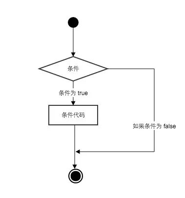

# 一、条件语句 #


## 1、什么是条件语句 ##


Python 条件语句跟其他语言基本一致的，都是通过一条或多条语句的执行结果（ True 或者 False ）来决定执行的代码块。

Python 程序语言指定任何非 0 和非空（null）值为 True，0 或者 null 为 False。

执行的流程图如下：




## 2、if 语句的基本形式 ##

Python 中，if 语句的基本形式如下：

```python
if 判断条件：
    执行语句……
else：
    执行语句……
```

之前的章节也提到过，Python 语言有着严格的缩进要求，因此这里也需要注意缩进，也不要少写了冒号 `:` 。

if 语句的判断条件可以用>（大于）、<(小于)、==（等于）、>=（大于等于）、<=（小于等于）来表示其关系。

例如：

```python
# -*-coding:utf-8-*-

results=59

if results>=60:
    print ('及格')
else :
    print ('不及格')

```

输出的结果为：

```txt
不及格
```

上面也说到，非零数值、非空字符串、非空 list 等，判断为 True，否则为 False。因此也可以这样写：

```python
num = 6
if num :
    print('Hello Python')
```

输出的结果如下：

```
Hello Python
```

可见，把结果打印出来了。

那如果我们把 `num ` 改为空字符串呢？

```python
num = ''
if num :
    print('Hello Python')
```

输出结果什么也没有打印（程序正常结束，没输出 `Hello Python`）。

很明显，空字符串是为 False 的，不符合条件语句，因此不会执行到  `print('Hello Python')`  这段代码。

还有再啰嗦一点，提醒一下，在条件判断代码中的冒号 `:` 后、下一行内容是一定要缩进的。不缩进是会报错的。

```python
num = ''
if num :
print('Hello Python')
```

运行后会报错：

```
  File "/Users/twowater/dev/python/test/com/twowater/test.py", line 4
    print('Hello Python')
        ^
IndentationError: expected an indented block
```

冒号和缩进是一种语法。它会帮助 Python 区分代码之间的层次，理解条件执行的逻辑及先后顺序。


## 3、if 语句多个判断条件的形式 ##

有些时候，我们的判断语句不可能只有两个，有些时候需要多个，比如上面的例子中大于 60 的为及格，那我们还要判断大于 90 的为优秀，在 80 到 90 之间的良好呢？

这时候需要用到 if 语句多个判断条件，

用伪代码来表示：

```python
if 判断条件1:
    执行语句1……
elif 判断条件2:
    执行语句2……
elif 判断条件3:
    执行语句3……
else:
    执行语句4……
```

实例：

```python
# -*-coding:utf-8-*-

results = 89

if results > 90:
    print('优秀')
elif results > 80:
    print('良好')
elif results > 60:
    print ('及格')
else :
    print ('不及格')

```

输出的结果：

```txt
良好
```


## 4、if 语句多个条件同时判断 ##

有时候我们会遇到多个条件的时候该怎么操作呢？

比如说要求 java 和 python 的考试成绩要大于 80 分的时候才算优秀，这时候该怎么做？

这时候我们可以结合 `or` 和  `and` 来使用。

or （或）表示两个条件有一个成立时判断条件成功
 
and （与）表示只有两个条件同时成立的情况下，判断条件才成功。

例如：

```python
# -*-coding:utf-8-*-

java = 86
python = 68

if java > 80 and  python > 80:
    print('优秀')
else :
    print('不优秀')

if ( java >= 80  and java < 90 )  or ( python >= 80 and python < 90):
    print('良好')

```

输出结果：

```txt
不优秀
良好
```

注意：if 有多个条件时可使用括号来区分判断的先后顺序，括号中的判断优先执行，此外 and 和 or 的优先级低于 >（大于）、<（小于）等判断符号，即大于和小于在没有括号的情况下会比与或要优先判断。

## 5、if 嵌套 ##

if 嵌套是指什么呢？

就跟字面意思差不多，指 if 语句中可以嵌套 if 语句。

比如上面说到的例子，也可以用 if 嵌套来写。

```python
java = 86
python = 68

if java > 80:
    if python > 80:
        print('优秀')
    else:
        print('不优秀')
else:
    print('不优秀')
```

输出结果：

```
不优秀
```

当然这只是为了说明 if 条件语句是可以嵌套的。如果是这个需求，我个人还是不太建议这样使用 if 嵌套的，因为这样代码量多了，而且嵌套太多，也不方便阅读代码。


## 6、 Python 3.10+ 的新写法：match / case ##

各位童鞋，如果你用的是 Python 3.10 或者更新的版本，那么除了 `if / elif / else` 之外，还多了一个更直观的家伙—— `match / case`，叫做「结构化模式匹配」（structural pattern matching）。

为什么要专门讲它啊？

我们先看一个需求，假设两点水想根据后台返回的「指令字符串」来做不同的事情：

```python
command = 'start'

if command == 'start':
    print('启动')
elif command == 'stop':
    print('停止')
elif command == 'pause':
    print('暂停')
else:
    print('未知指令')
```

输出的结果：

```
启动
```

这样写没毛病，但是当分支多起来的时候，一长串 `elif` 就显得啰嗦了。我们用 `match / case` 重写一下：

```python
command = 'start'

match command:
    case 'start':
        print('启动')
    case 'stop':
        print('停止')
    case 'pause':
        print('暂停')
    case _:
        print('未知指令')
```

输出的结果：

```
启动
```

这里的 `case _` 就是兜底分支，相当于 `else`，下划线 `_` 是个通配符，匹配任何还没被前面 case 命中的情况。

看到这里，善于思考的你可能会问：那这跟 `switch / case` 不就一样吗？换个语法糖而已嘛。

并不是的， `match / case` 真正的厉害之处，是它能匹配「结构」，不仅仅是「值」。

来看一个序列匹配的例子，假设产品反馈过来一个坐标数据：

```python
point = [10, 20]

match point:
    case [0, 0]:
        print('原点')
    case [x, 0]:
        print(f'在 x 轴上，x = {x}')
    case [0, y]:
        print(f'在 y 轴上，y = {y}')
    case [x, y]:
        print(f'普通点，x = {x}，y = {y}')
    case _:
        print('不是二维坐标')
```

输出的结果：

```
普通点，x = 10，y = 20
```

是不是发现，这里不光匹配到了「这是一个长度为 2 的列表」，还顺手把 `x` 、 `y` 给「解包」出来了，下面分支里直接就能用。

序列里还可以用 `*rest` 来收集剩下的元素：

```python
nums = [1, 2, 3, 4, 5]

match nums:
    case [first, *rest]:
        print(f'第一个：{first}，剩下的：{rest}')
```

输出的结果：

```
第一个：1，剩下的：[2, 3, 4, 5]
```

那么字典呢？

`match / case` 也能匹配字典的「形状」：

```python
response = {'status': 'ok', 'data': [1, 2, 3]}

match response:
    case {'status': 'ok', 'data': data}:
        print(f'成功，拿到数据 {data}')
    case {'status': 'error', 'message': msg}:
        print(f'失败：{msg}')
    case _:
        print('未知响应')
```

输出的结果：

```
成功，拿到数据 [1, 2, 3]
```

更有意思的是，`match / case` 还能跟「类」一起用，配合 `dataclass` 食用，效果更佳：

```python
from dataclasses import dataclass


@dataclass
class Point:
    x: int
    y: int


p = Point(0, 5)

match p:
    case Point(x=0, y=0):
        print('原点')
    case Point(x=0, y=y):
        print(f'在 y 轴上，y = {y}')
    case Point(x=x, y=0):
        print(f'在 x 轴上，x = {x}')
    case Point(x=x, y=y):
        print(f'普通点 ({x}, {y})')
```

输出的结果：

```
在 y 轴上，y = 5
```

最后，再介绍一个小特性，叫「守卫条件」（guard），就是在 `case` 后面加一个 `if`：

```python
score = 75

match score:
    case x if x >= 90:
        print('优秀')
    case x if x >= 80:
        print('良好')
    case x if x >= 60:
        print('及格')
    case _:
        print('不及格')
```

输出的结果：

```
及格
```

是不是发现，有了 `match / case` 之后，代码更结构化也更好读了？

这里也啰嗦一句，`match / case` 不是用来取代 `if / elif` 的。简单的「值比较」、「真假判断」，老老实实写 `if` 反而更清楚；只有当你要根据「数据的结构」来分发逻辑的时候，比如解析 JSON、处理 AST、写解释器之类的场景，`match / case` 才能真正发挥威力。


