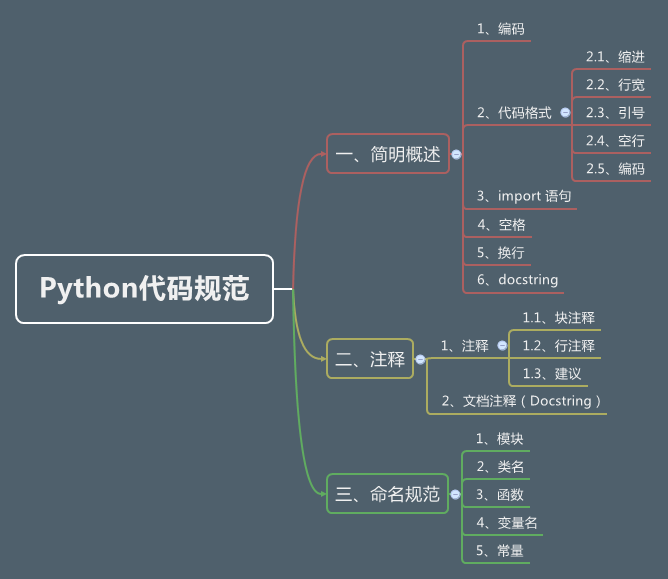

# 前言 #

本来不应该把这个章节放在那面前面的，因为还没进行学习之前，直接看这个章节，会感觉有很多莫名其妙的东西。

但是把这个章节放在前面的用意，只是让大家预览一下，有个印象，而且在以后的学习中，也方便大家查阅。

# 目录 #

- [一、简明概述](codeSpecification_first.md)
    - 1、编码
    - 2、代码格式
        - 2.1、缩进
        - 2.2、行宽
        - 2.3、引号
        - 2.4、空行
        - 2.5、编码
    - 3、import 语句
    - 4、空格
    - 5、换行
    - 6、docstring
- [二、注释](codeSpecification_second.md)
    - 1、注释
        - 1.1、块注释
        - 1.2、行注释
        - 1.3、建议
    - 2、文档注释（Docstring）
- [三、命名规范](codeSpecification_third.md)
    - 1、模块
    - 2、类名
    - 3、函数
    - 4、变量名
    - 5、常量

